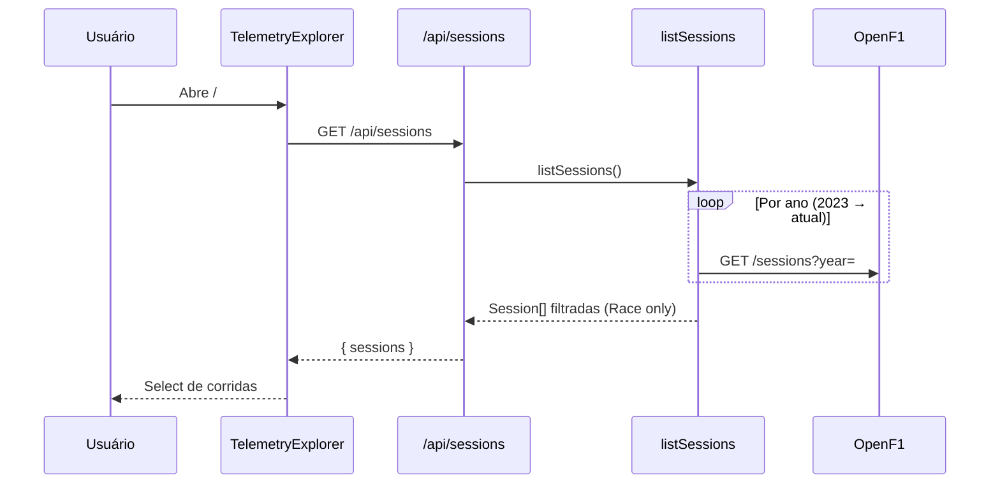
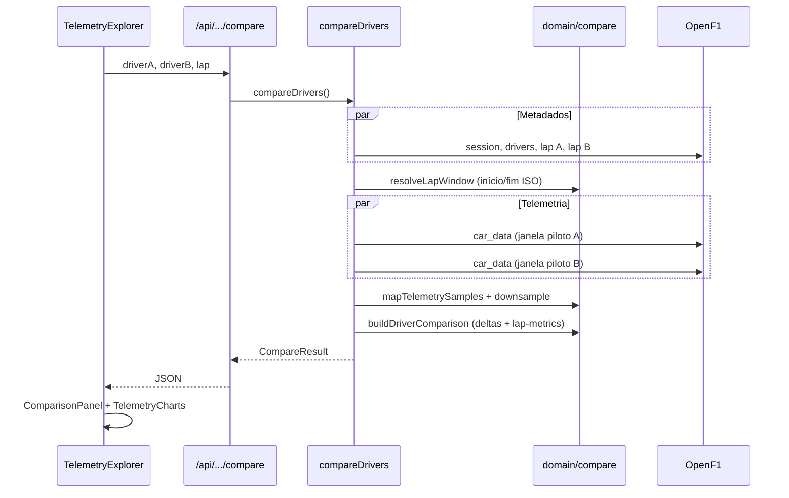
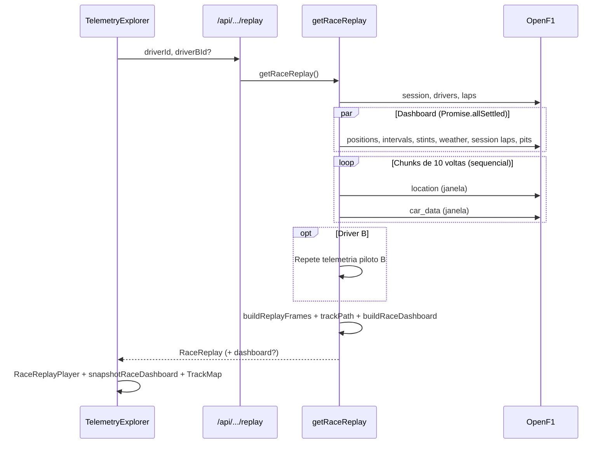

# F1 Apex — Architecture Guide

Documento de referência da arquitetura do projeto, do nível macro até os fluxos de dados e decisões operacionais.

Para decisões pontuais, consulte também os [ADRs](../adr/).

---

## 1. High level

O **F1 Apex** é uma aplicação web que consome dados públicos da [OpenF1](https://openf1.org/) e um feed local de notícias para:

- **Race replay** — reproduzir uma corrida inteira no mapa do circuito (solo ou battle), com timing board estilo broadcast (grid, setores, pits, clima)
- **Compare lap** — comparar telemetria de dois pilotos em uma volta específica
- **News** — briefing de headlines F1 com atribuição de fonte (conteúdo estático em JSON)

A arquitetura segue um princípio simples: **um único app Next.js** hospedado na Vercel. Não há backend separado, banco de dados ou fila no MVP. News é servida de `data/news/articles.json` (gerado por script local).

```text
┌─────────────────────────────────────────────────────────────┐
│                        Browser (React)                       │
│   TelemetryExplorer · RaceReplayPlayer · RaceDashboard · TrackMap │
│   TelemetryCharts · ModeNav · ShareButtons · NewsArticleView      │
└────────────────────────────┬────────────────────────────────┘
                             │ fetch("/api/*")  same-origin
                             ▼
┌─────────────────────────────────────────────────────────────┐
│              Next.js (App Router + Route Handlers)           │
│                                                              │
│   app/api/*  →  lib/application  →  lib/domain               │
│   app/news/* →  lib/application/news (JSON local)            │
│                      ↓                                       │
│           lib/infrastructure/openf1                          │
└────────────────────────────┬────────────────────────────────┘
                             │ HTTPS (server-side only)
                             ▼
                    OpenF1 Public API
                  api.openf1.org/v1
```

**Por que essa forma?**

| Benefício | Detalhe |
|-----------|---------|
| Deploy simples | Push no GitHub → Vercel builda e publica |
| Sem infra extra | Sem Postgres, Redis ou NestJS no MVP |
| Front isolado da OpenF1 | Credenciais, rate limit e formatos externos ficam no server |
| Evolução futura | Lógica em `lib/` pode ser extraída para outro serviço depois |

Ver [ADR-001 — Next.js-only](../adr/ADR-001-nextjs-only.md).

---

## 2. Camadas

O código segue separação por responsabilidade, inspirada em Clean Architecture, sem over-engineering.

```text
Browser UI
   │
   ▼
Route Handlers          app/api/**/route.ts
   │                    Validação (Zod), HTTP, maxDuration
   ▼
Application             lib/application/
   │                    Casos de uso: listSessions, compareDrivers, getRaceReplay, listNewsArticles
   ▼
Domain                  lib/domain/
   │                    Tipos, regras puras, normalização, cálculos, share links
   ▼
Infrastructure          lib/infrastructure/openf1/  (+ news/store para JSON)
   │                    HTTP client, tipos OpenF1, mappers
   ▼
OpenF1 API              data/news/articles.json (local)
```

### Regra de dependência

- **Domain** não importa Next.js, React nem OpenF1
- **Application** orquestra domain + infrastructure
- **Route Handlers** são finos: parse → chama application → JSON
- **Components** só conhecem tipos de domínio e `/api/*` (News lê JSON via application em RSC)

---

## 3. Estrutura de pastas

```text
f1-telemetry/
├── app/
│   ├── page.tsx                    # Home → TelemetryExplorer
│   ├── layout.tsx                  # Fonts, metadata, shell global
│   ├── news/
│   │   ├── page.tsx                # Lista de artigos
│   │   └── [slug]/page.tsx         # Artigo individual
│   └── api/sessions/
│       ├── route.ts                # GET /api/sessions
│       └── [sessionId]/
│           ├── drivers/route.ts
│           ├── laps/route.ts
│           ├── compare/route.ts
│           └── replay/route.ts
│
├── components/                     # UI React (client components)
│   ├── TelemetryExplorer.tsx       # Orquestrador de estado + fetch + deep links
│   ├── ModeNav.tsx                 # Replay | Compare | News
│   ├── ReplayFilters.tsx
│   ├── ExplorerFilters.tsx
│   ├── RaceReplayPlayer.tsx
│   ├── RaceDashboard.tsx           # Header, leaderboard, live timing (broadcast)
│   ├── TrackMap.tsx
│   ├── TelemetryCharts.tsx
│   ├── ComparisonPanel.tsx         # Timing + driving profile
│   ├── ShareButtons.tsx            # Share / Copy link (reutilizado)
│   ├── NewsShareButtons.tsx        # Re-export de ShareButtons
│   ├── NewsCard.tsx
│   ├── NewsArticleView.tsx
│   └── AppShell.tsx
│
├── data/news/
│   └── articles.json               # Feed estático (npm run scrape:news)
│
├── lib/
│   ├── domain/
│   │   ├── types.ts
│   │   ├── session.ts
│   │   ├── compare.ts
│   │   ├── replay.ts
│   │   ├── replay-trail.ts         # Segmentos de trail no mapa (anti-corda)
│   │   ├── dashboard.ts            # Race dashboard: grid, setores, pits, snapshot
│   │   ├── track-sectors.ts        # Split do traçado em S1/S2/S3
│   │   ├── laps.ts                 # Interseção A∩B de voltas comparáveis
│   │   ├── share-links.ts          # Build/parse de deep links
│   │   ├── telemetry-series.ts
│   │   ├── news.ts
│   │   └── analysis/
│   │       └── lap-metrics.ts      # Driving profile (speed, throttle, brake)
│   │
│   ├── application/
│   │   ├── sessions.ts             # listSessions, listLaps, listComparableLaps
│   │   ├── compare.ts
│   │   ├── replay.ts
│   │   └── news.ts
│   │
│   ├── infrastructure/
│   │   ├── openf1/
│   │   │   ├── client.ts
│   │   │   ├── types.ts
│   │   │   └── mappers.ts
│   │   └── news/
│   │       ├── store.ts
│   │       └── sanitize.ts
│   │
│   ├── api/
│   │   ├── errors.ts
│   │   └── openf1-messages.ts
│   │
│   ├── format.ts
│   └── format-news.ts
│
├── scripts/
│   └── scrape-news.ts              # Gera data/news/articles.json
│
└── docs/
    ├── architecture/
    └── adr/
```

---

## 4. Modelo de domínio

Tipos centrais em `lib/domain/types.ts`:

| Tipo | Descrição |
|------|-----------|
| `Session` | Corrida (Race): país, circuito, datas, `isUpcoming` |
| `Driver` | Piloto: número, acronym, equipe, cor |
| `Lap` | Volta: tempo, setores, `dateStart` |
| `TelemetrySample` | Amostra normalizada: speed, throttle, brake, gear, tempo relativo |
| `LapDrivingMetrics` | Agregados de telemetria: max/avg speed, throttle, % full throttle, % braking |
| `DriverComparison` | Dois pilotos + deltas + telemetria A/B + `metricsA` / `metricsB` |
| `RaceReplay` | Frames de playback, track path SVG, duração, voltas, `dashboard?` |
| `RaceDashboard` | Série temporal de positions, intervals, stints, pits, weather, session laps |
| `RaceDashboardSnapshot` | Estado do dashboard em um instante do replay (leaderboard + focused drivers) |
| `LeaderboardRow` | Linha do grid: pos, tempos, tyre, gap, setores coloridos, pits |
| `NewsArticle` | Artigo: slug, título, fonte, data, excerpt, corpo sanitizado |

O domínio **não espelha** o JSON da OpenF1. Os mappers traduzem formatos externos para o que a aplicação precisa.

Ver [ADR-003 — Telemetry normalization](../adr/ADR-003-telemetry-normalization.md).

---

## 5. API interna

O frontend nunca chama `api.openf1.org`. Todos os endpoints de telemetria são Route Handlers Next.js:

| Método | Rota | Caso de uso |
|--------|------|-------------|
| `GET` | `/api/sessions` | Listar corridas (Race, 2023+) |
| `GET` | `/api/sessions/:sessionId/drivers` | Pilotos da sessão |
| `GET` | `/api/sessions/:sessionId/laps?driverId=&driverBId?` | Voltas do piloto A; com `driverBId`, retorna também `comparableLapNumbers` (interseção A∩B) |
| `GET` | `/api/sessions/:sessionId/compare?driverA=&driverB=&lap=` | Comparar uma volta |
| `GET` | `/api/sessions/:sessionId/replay?driverId=&driverBId?` | Replay da corrida |

**News** não usa Route Handler: páginas em `app/news/*` leem `data/news/articles.json` via `lib/application/news.ts`.

Rotas pesadas (`compare`, `replay`) declaram `export const maxDuration = 60` para Vercel Pro.

Validação de query params com **Zod** onde aplicável. Erros passam por `toErrorResponse()` em `lib/api/errors.ts`.

---

## 6. Fluxo: carregar a app



**Filtros aplicados no server:**

- Apenas sessões com `session_name === "Race"`
- Corridas canceladas removidas
- Corridas futuras marcadas com `isUpcoming` (disabled na UI)

### Deep links (share)

`TelemetryExplorer` lê query params na carga inicial e **auto-carrega** replay ou compare:

| Modo | Query params | Exemplo |
|------|--------------|---------|
| Replay | `session`, `driver`, `driverB?` | `/?session=11342&driver=44&driverB=16` |
| Compare | `mode=compare`, `session`, `driverA`, `driverB`, `lap` | `/?mode=compare&session=11342&driverA=44&driverB=16&lap=17` |

- `session` = OpenF1 `session_key` (ID numérico da corrida)
- `driver` / `driverA` / `driverB` = `driver_number` (número do piloto)

Após carregar dados com sucesso, a URL é sincronizada via `history.replaceState`. Botões **Share** / **Copy link** (`ShareButtons`) aparecem só quando replay ou compare está visível.

Lógica em `lib/domain/share-links.ts`; UI reutiliza o mesmo componente da News.

---

## 7. Fluxo: Compare lap

Caso de uso leve — ideal para plano Hobby da Vercel (~10s).



**Passos principais:**

1. UI exige **Driver B** antes de habilitar o select de lap
2. `listComparableLaps` retorna voltas do piloto A com `comparableLapNumbers` = interseção A∩B (voltas com tempo válido em ambos)
3. Voltas não compartilhadas aparecem **disabled** no select
4. Busca metadados da volta (tempo, setores, `date_start`)
5. Calcula janela temporal: `date_start` → `date_start + lap_duration`
6. Busca `car_data` nessa janela (~3.7 Hz → ~300–400 pontos/volta)
7. Converte timestamps UTC para **tempo relativo** (0s = início da volta)
8. Calcula deltas de volta e setores (A − B)
9. Calcula **driving profile** (`computeLapDrivingMetrics`): max/avg speed, avg throttle, % full throttle, % braking
10. UI reamostra ambos os pilotos num **grid de tempo comum** antes de plotar (Recharts)

---

## 8. Fluxo: Race replay

Caso de uso pesado — dezenas de requests à OpenF1; recomendado Vercel Pro (60s).



**Race dashboard:**

- Carregado em paralelo com a telemetria (`loadRaceDashboard`); falha parcial não bloqueia o replay
- `buildRaceDashboard` (domain) normaliza positions, intervals, stints, pits e weather
- No client, `snapshotRaceDashboard` projeta o instante atual do scrubber → leaderboard + live timing dos pilotos focados
- UI em grid 3 colunas (`lg+`): standings | mapa | timing, mesma altura; standings com scroll interno
- Cinema mode (`T`) esconde o painel de setup e expande o replay

**Estratégia de fetch (telemetria):**

- Voltas divididas em chunks de **10**
- Requests **sequenciais** (location → car_data por chunk)
- Driver B carregado **depois** do A (battle replay)
- Fila global no client OpenF1 com gap de 200ms + retry com backoff

**Renderização do mapa (`TrackMap` + `replay-trail`):**

- `viewBox` calculado **apenas** a partir do contorno da pista (`trackPath`) — evita distorção ao scrubbar
- Traçado dividido em S1/S2/S3 (`buildTrackSectorPaths`) a partir dos tempos de setor da outline lap; fallback em terços iguais
- Setor ativo destacado via `resolveActiveSector` (tempo decorrido da volta atual)
- Trail do carro = segmentos curtos (`buildCarTrailSegments`): mesma volta, ~10s de histórico
- Quebra de segmento em saltos espaciais/temporais grandes (anti-corda ao pular no scrubber)

---

## 9. Integração OpenF1

Toda comunicação externa passa por `lib/infrastructure/openf1/client.ts`.

### Endpoints usados

| OpenF1 | Uso |
|--------|-----|
| `GET /sessions` | Listar sessões por ano |
| `GET /sessions?session_key=` | Detalhe de uma sessão |
| `GET /drivers` | Pilotos da sessão |
| `GET /laps` | Voltas (com filtros) |
| `GET /car_data` | Speed, throttle, brake, gear, rpm |
| `GET /location` | Coordenadas x/y no circuito (replay) |
| `GET /position` | Posição na corrida ao longo do tempo |
| `GET /intervals` | Gap para o líder e intervalo entre carros |
| `GET /stints` | Composto e idade do pneu |
| `GET /pit` | Pit stops (contagem, última parada) |
| `GET /weather` | Temperatura pista/ar, chuva |

Ver [ADR-002 — OpenF1](../adr/ADR-002-openf1.md).

### Resiliência

| Mecanismo | Comportamento |
|-----------|---------------|
| Fila de requests | Gap mínimo de 200ms entre chamadas |
| Retry | Até 5 tentativas com backoff exponencial |
| `Retry-After` | Respeitado em respostas 429 |
| Cache | `fetch` com `revalidate: 86400` (24h) para histórico |
| Erros tipados | `OpenF1Error` com status HTTP e código (`RATE_LIMIT`, `UNAVAILABLE`) |

Mensagens amigáveis para o usuário ficam em `lib/api/openf1-messages.ts` e são exibidas na UI via `TelemetryExplorer`.

### Configuração

```bash
# .env.local (opcional)
OPENF1_BASE_URL=https://api.openf1.org/v1
```

Se ausente, o client usa o default público.

---

## 10. News

Feed estático — **sem runtime scrape** em produção.

```text
npm run scrape:news  →  scripts/scrape-news.ts  →  data/news/articles.json
                                                              ↓
app/news/page.tsx  →  lib/application/news.ts  →  lib/infrastructure/news/store.ts
```

- Fontes: Motorsport.com, Autosport (RaceFans quando disponível)
- Corpo HTML sanitizado em `lib/infrastructure/news/sanitize.ts`
- Slugs em `lib/domain/news.ts` (`buildNewsSlug`)
- Share por artigo via `NewsShareButtons` → `/news/[slug]`

Refresh: rodar scrape localmente e commitar o JSON atualizado.

---

## 11. Frontend

### Orquestração

`TelemetryExplorer` é o componente raiz da home. Mantém:

- Modo atual (`replay` | `compare`) via `?mode=compare` ou default replay
- Estado de filtros (sessão, pilotos, volta)
- Loading / error states
- Fetch para `/api/*`
- Bootstrap a partir de **deep links** na URL
- Sincronização da URL após load bem-sucedido

### Modos

| Modo | Componentes | Interação |
|------|-------------|-----------|
| **Race replay** | `ReplayFilters`, `RaceReplayPlayer`, `RaceDashboard`, `TrackMap`, `ShareButtons` | Play/pause, scrubber, 1x–16x, HUD, grid broadcast, cinema mode, share link |
| **Compare lap** | `ExplorerFilters`, `ComparisonPanel`, `TelemetryCharts`, `ShareButtons` | Charts sincronizados; driving profile; laps A∩B |
| **News** | `app/news/*`, `NewsCard`, `NewsArticleView` | Lista + artigo; share/copy por slug |

Navegação entre modos: `ModeNav` (links para `/`, `/?mode=compare`, `/news`).

### Visualização

- **Recharts** para speed, throttle, brake, gear
- **SVG** para mapa do circuito (coordenadas OpenF1 normalizadas)
- Tema dark, accent F1 red (`#E10600`)

Ver [ADR-004 — Visual and charts](../adr/ADR-004-visual-and-charts.md).

---

## 12. Tratamento de erros

```text
OpenF1Error (server)
      ↓
toErrorResponse()  →  { error, title?, code? }
      ↓
TelemetryExplorer  →  banner com título + mensagem
```

Casos comuns:

| Situação | Resposta |
|----------|----------|
| Rate limit (429) | "Rate limit reached" + explicação da API gratuita |
| OpenF1 indisponível | "OpenF1 unavailable" + pedir retry |
| Volta não completada por ambos | 400 — lap not completed by both drivers |
| Volta/corrida inválida | 400/404 com mensagem específica |
| Corrida futura | 400 — race has not happened yet |
| Deep link inválido | Mensagem na UI (sessão/piloto/lap não encontrados) |

---

## 13. Deploy

```text
GitHub (main)  →  Vercel  →  npm run build  →  Serverless Functions
```

| Aspecto | Detalhe |
|---------|---------|
| Hosting | Vercel (framework Next.js auto-detect) |
| Env | `OPENF1_BASE_URL` opcional |
| Timeout Hobby | 10s — replay pode falhar |
| Timeout Pro | 60s — recomendado para race replay |
| News | `data/news/articles.json` versionado no repo |

Config em `vercel.json` (build/install commands).

---

## 14. Testes

**Vitest** cobre lógica de domínio e mappers:

- `lib/domain/*.test.ts` — deltas, lap window, replay frames, série sincronizada
- `lib/domain/dashboard.test.ts` — grid, setores, pits, snapshot do dashboard
- `lib/domain/laps.test.ts` — interseção A∩B
- `lib/domain/share-links.test.ts` — deep links
- `lib/domain/replay-trail.test.ts` — segmentos de trail
- `lib/domain/analysis/lap-metrics.test.ts` — driving profile
- `lib/infrastructure/openf1/mappers.test.ts` — mapeamento OpenF1 → domínio
- `lib/format.test.ts` — labels de sessão

```bash
npm run test
npm run lint
npm run build
```

Testes de integração com OpenF1 real não rodam no CI (dependência externa + rate limit).

---

## 15. Análise

A análise atual é **determinística** (sem ML):

| Camada | O que calcula |
|--------|----------------|
| Timing | Deltas de volta e setor (A − B) |
| Race dashboard | Leaderboard por instante, setores purple/green/yellow, pits, fastest lap, weather |
| Driving profile | Max/avg speed, avg throttle, % full throttle, % braking por piloto |
| Charts | Telemetria reamostrada em grid comum para comparação visual |

Implementado em `lib/domain/compare.ts`, `lib/domain/dashboard.ts`, `lib/domain/analysis/lap-metrics.ts` e exibido em `ComparisonPanel` / `RaceDashboard`.

Ver [ADR-005 — Analysis engine](../adr/ADR-005-analysis-engine.md).

Evolução natural (fora do escopo atual):

- Insights por setor/curva, braking points automáticos
- Postgres para cache durável entre instâncias serverless
- Backend dedicado se compare/replay exigir pré-processamento

---

## 16. Referências rápidas

| Documento | Conteúdo |
|-----------|----------|
| [overview.md](./overview.md) | Diagrama resumido |
| [ADR-001](../adr/ADR-001-nextjs-only.md) | Por que Next.js only |
| [ADR-002](../adr/ADR-002-openf1.md) | OpenF1 como fonte |
| [ADR-003](../adr/ADR-003-telemetry-normalization.md) | Tempo relativo por volta |
| [ADR-004](../adr/ADR-004-visual-and-charts.md) | UI e charts |
| [ADR-005](../adr/ADR-005-analysis-engine.md) | Deltas determinísticos |
| [README.md](../../README.md) | Setup, deploy, checklist pós-deploy |

---

## 17. Resumo

> **Browser** pede dados ao **próprio Next.js** via `/api/*`. Route Handlers delegam para **application**, que aplica **regras de domínio** e busca tudo na **OpenF1** de forma controlada. News vem de JSON local. Deep links permitem compartilhar replay e compare; laps comparáveis respeitam interseção A∩B; driving profile enriquece compare; race replay inclui timing board broadcast (positions, intervals, stints, pits, weather); trail no mapa evita cordas ao scrubbar. O resultado volta como JSON tipado e a UI renderiza replay, comparação ou news — sem expor a API externa ao client.
