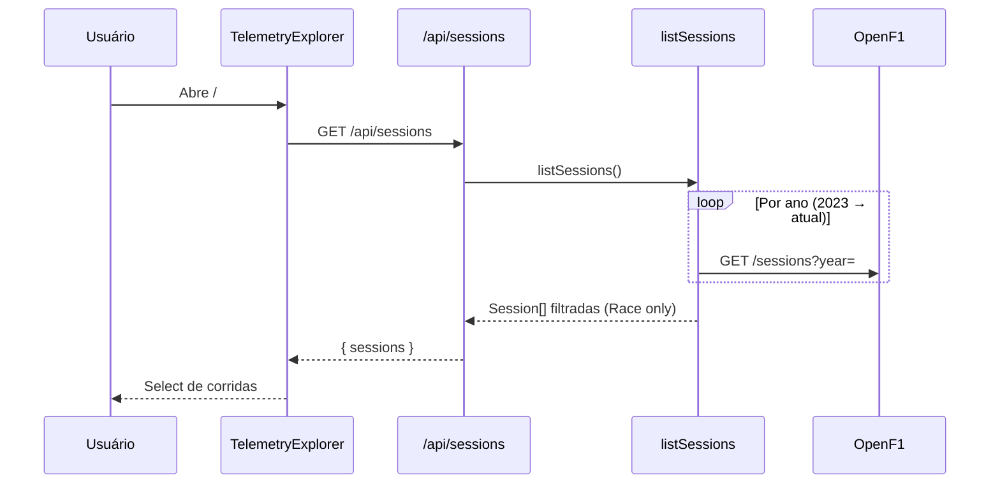
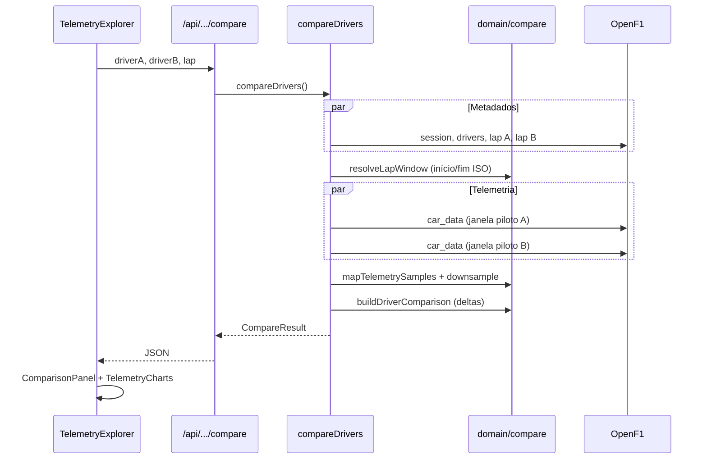
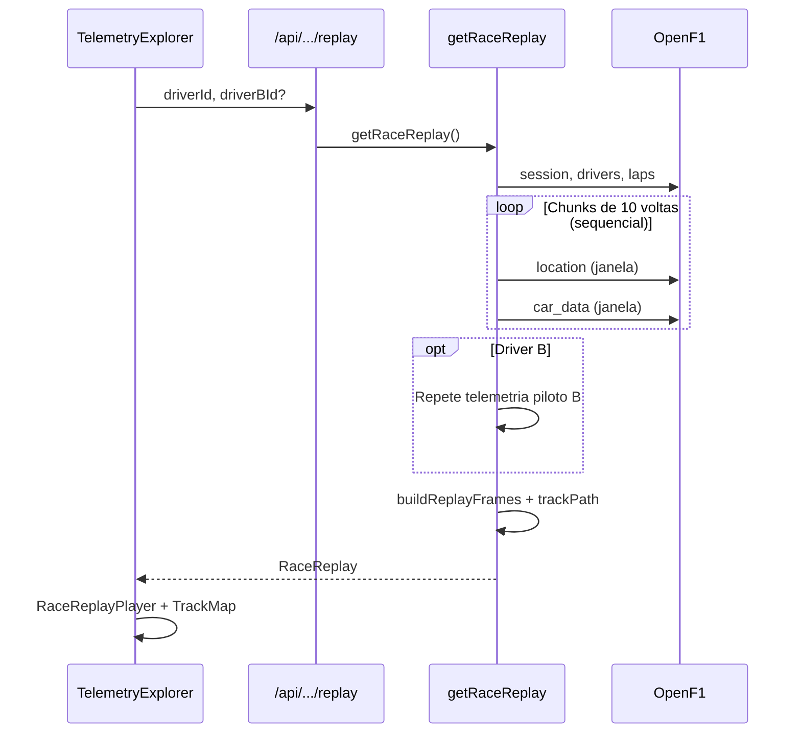

# F1 Telemetry Explorer — Architecture Guide

Documento de referência da arquitetura do projeto, do nível macro até os fluxos de dados e decisões operacionais.

Para decisões pontuais, consulte também os [ADRs](../adr/).

---

## 1. High level

O **F1 Telemetry Explorer** é uma aplicação web que consome dados públicos da [OpenF1](https://openf1.org/) para:

- **Race replay** — reproduzir uma corrida inteira no mapa do circuito
- **Compare lap** — comparar telemetria de dois pilotos em uma volta específica

A arquitetura segue um princípio simples: **um único app Next.js** hospedado na Vercel. Não há backend separado, banco de dados ou fila no MVP.

```text
┌─────────────────────────────────────────────────────────────┐
│                        Browser (React)                       │
│   TelemetryExplorer · RaceReplayPlayer · TelemetryCharts    │
└────────────────────────────┬────────────────────────────────┘
                             │ fetch("/api/*")  same-origin
                             ▼
┌─────────────────────────────────────────────────────────────┐
│              Next.js (App Router + Route Handlers)           │
│                                                              │
│   app/api/*  →  lib/application  →  lib/domain               │
│                      ↓                                       │
│           lib/infrastructure/openf1                          │
└────────────────────────────┬────────────────────────────────┘
                             │ HTTPS (server-side only)
                             ▼
                    OpenF1 Public API
                  api.openf1.org/v1
```

**Por que essa forma?**

| Benefício | Detalhe |
|-----------|---------|
| Deploy simples | Push no GitHub → Vercel builda e publica |
| Sem infra extra | Sem Postgres, Redis ou NestJS no MVP |
| Front isolado da OpenF1 | Credenciais, rate limit e formatos externos ficam no server |
| Evolução futura | Lógica em `lib/` pode ser extraída para outro serviço depois |

Ver [ADR-001 — Next.js-only](../adr/ADR-001-nextjs-only.md).

---

## 2. Camadas

O código segue separação por responsabilidade, inspirada em Clean Architecture, sem over-engineering.

```text
Browser UI
   │
   ▼
Route Handlers          app/api/**/route.ts
   │                    Validação (Zod), HTTP, maxDuration
   ▼
Application             lib/application/
   │                    Casos de uso: listSessions, compareDrivers, getRaceReplay
   ▼
Domain                  lib/domain/
   │                    Tipos, regras puras, normalização, cálculos
   ▼
Infrastructure          lib/infrastructure/openf1/
   │                    HTTP client, tipos OpenF1, mappers
   ▼
OpenF1 API
```

### Regra de dependência

- **Domain** não importa Next.js, React nem OpenF1
- **Application** orquestra domain + infrastructure
- **Route Handlers** são finos: parse → chama application → JSON
- **Components** só conhecem tipos de domínio e `/api/*`

---

## 3. Estrutura de pastas

```text
f1-telemetry/
├── app/
│   ├── page.tsx                    # Home → TelemetryExplorer
│   ├── layout.tsx                  # Fonts, metadata, shell global
│   └── api/sessions/
│       ├── route.ts                # GET /api/sessions
│       └── [sessionId]/
│           ├── drivers/route.ts
│           ├── laps/route.ts
│           ├── compare/route.ts
│           └── replay/route.ts
│
├── components/                     # UI React (client components)
│   ├── TelemetryExplorer.tsx       # Orquestrador de estado + fetch
│   ├── ReplayFilters.tsx
│   ├── ExplorerFilters.tsx
│   ├── RaceReplayPlayer.tsx
│   ├── TrackMap.tsx
│   ├── TelemetryCharts.tsx
│   └── ComparisonPanel.tsx
│
├── lib/
│   ├── domain/                     # Regras e modelos
│   │   ├── types.ts
│   │   ├── session.ts
│   │   ├── compare.ts
│   │   ├── replay.ts
│   │   └── telemetry-series.ts
│   │
│   ├── application/                # Casos de uso
│   │   ├── sessions.ts
│   │   ├── compare.ts
│   │   └── replay.ts
│   │
│   ├── infrastructure/openf1/      # Integração externa
│   │   ├── client.ts
│   │   ├── types.ts
│   │   └── mappers.ts
│   │
│   ├── api/                        # Helpers HTTP
│   │   ├── errors.ts
│   │   └── openf1-messages.ts
│   │
│   └── format.ts                   # Formatação de labels na UI
│
└── docs/
    ├── architecture/               # Este documento
    └── adr/                        # Architecture Decision Records
```

---

## 4. Modelo de domínio

Tipos centrais em `lib/domain/types.ts`:

| Tipo | Descrição |
|------|-----------|
| `Session` | Corrida (Race): país, circuito, datas, `isUpcoming` |
| `Driver` | Piloto: número, acronym, equipe, cor |
| `Lap` | Volta: tempo, setores, `dateStart` |
| `TelemetrySample` | Amostra normalizada: speed, throttle, brake, gear, tempo relativo |
| `DriverComparison` | Dois pilotos + deltas de volta/setor + telemetria A/B |
| `RaceReplay` | Frames de playback, track path SVG, duração, voltas |

O domínio **não espelha** o JSON da OpenF1. Os [mappers](../infrastructure) traduzem formatos externos para o que a aplicação precisa.

Ver [ADR-003 — Telemetry normalization](../adr/ADR-003-telemetry-normalization.md).

---

## 5. API interna

O frontend nunca chama `api.openf1.org`. Todos os endpoints são Route Handlers Next.js:

| Método | Rota | Caso de uso |
|--------|------|-------------|
| `GET` | `/api/sessions` | Listar corridas (Race, 2023+) |
| `GET` | `/api/sessions/:sessionId/drivers` | Pilotos da sessão |
| `GET` | `/api/sessions/:sessionId/laps?driverId=` | Voltas de um piloto |
| `GET` | `/api/sessions/:sessionId/compare?driverA=&driverB=&lap=` | Comparar uma volta |
| `GET` | `/api/sessions/:sessionId/replay?driverId=&driverBId=` | Replay da corrida |

Rotas pesadas (`compare`, `replay`) declaram `export const maxDuration = 60` para Vercel Pro.

Validação de query params com **Zod** onde aplicável. Erros passam por `toErrorResponse()` em `lib/api/errors.ts`.

---

## 6. Fluxo: carregar a app



**Filtros aplicados no server:**

- Apenas sessões com `session_name === "Race"`
- Corridas canceladas removidas
- Corridas futuras marcadas com `isUpcoming` (disabled na UI)

---

## 7. Fluxo: Compare lap

Caso de uso leve — ideal para plano Hobby da Vercel (~10s).



**Passos principais:**

1. Busca metadados da volta (tempo, setores, `date_start`)
2. Calcula janela temporal: `date_start` → `date_start + lap_duration`
3. Busca `car_data` nessa janela (~3.7 Hz → ~300–400 pontos/volta)
4. Converte timestamps UTC para **tempo relativo** (0s = início da volta)
5. Calcula deltas de volta e setores (A − B)
6. UI reamostra ambos os pilotos num **grid de tempo comum** antes de plotar (Recharts)

---

## 8. Fluxo: Race replay

Caso de uso pesado — dezenas de requests à OpenF1; recomendado Vercel Pro (60s).



**Estratégia de fetch:**

- Voltas divididas em chunks de **10**
- Requests **sequenciais** (location → car_data por chunk)
- Driver B carregado **depois** do A (battle replay)
- Fila global no client OpenF1 com gap de 200ms + retry com backoff

Isso reduz erros **429 Too Many Requests** da API gratuita.

---

## 9. Integração OpenF1

Toda comunicação externa passa por `lib/infrastructure/openf1/client.ts`.

### Endpoints usados

| OpenF1 | Uso |
|--------|-----|
| `GET /sessions` | Listar sessões por ano |
| `GET /sessions?session_key=` | Detalhe de uma sessão |
| `GET /drivers` | Pilotos da sessão |
| `GET /laps` | Voltas (com filtros) |
| `GET /car_data` | Speed, throttle, brake, gear, rpm |
| `GET /location` | Coordenadas x/y no circuito (replay) |

Ver [ADR-002 — OpenF1](../adr/ADR-002-openf1.md).

### Resiliência

| Mecanismo | Comportamento |
|-----------|---------------|
| Fila de requests | Gap mínimo de 200ms entre chamadas |
| Retry | Até 5 tentativas com backoff exponencial |
| `Retry-After` | Respeitado em respostas 429 |
| Cache | `fetch` com `revalidate: 86400` (24h) para histórico |
| Erros tipados | `OpenF1Error` com status HTTP e código (`RATE_LIMIT`, `UNAVAILABLE`) |

Mensagens amigáveis para o usuário ficam em `lib/api/openf1-messages.ts` e são exibidas na UI via `TelemetryExplorer`.

### Configuração

```bash
# .env.local (opcional)
OPENF1_BASE_URL=https://api.openf1.org/v1
```

Se ausente, o client usa o default público.

---

## 10. Frontend

### Orquestração

`TelemetryExplorer` é o componente raiz. Mantém:

- Modo atual (`replay` | `compare`)
- Estado de filtros (sessão, pilotos, volta)
- Loading / error states
- Fetch para `/api/*`

### Modos

| Modo | Componentes | Interação |
|------|-------------|-----------|
| **Race replay** | `ReplayFilters`, `RaceReplayPlayer`, `TrackMap` | Play/pause, scrubber, 1x–16x, HUD |
| **Compare lap** | `ExplorerFilters`, `ComparisonPanel`, `TelemetryCharts` | Charts sincronizados por hover |

### Visualização

- **Recharts** para speed, throttle, brake, gear
- **SVG** para mapa do circuito (coordenadas OpenF1 normalizadas)
- Tema dark, accent F1 red (`#E10600`)

Ver [ADR-004 — Visual and charts](../adr/ADR-004-visual-and-charts.md).

---

## 11. Tratamento de erros

```text
OpenF1Error (server)
      ↓
toErrorResponse()  →  { error, title?, code? }
      ↓
TelemetryExplorer  →  banner com título + mensagem
```

Casos comuns:

| Situação | Resposta |
|----------|----------|
| Rate limit (429) | "Rate limit reached" + explicação da API gratuita |
| OpenF1 indisponível | "OpenF1 unavailable" + pedir retry |
| Volta/corrida inválida | 400/404 com mensagem específica |
| Corrida futura | 400 — race has not happened yet |

---

## 12. Deploy

```text
GitHub (main)  →  Vercel  →  npm run build  →  Serverless Functions
```

| Aspecto | Detalhe |
|---------|---------|
| Hosting | Vercel (framework Next.js auto-detect) |
| Env | `OPENF1_BASE_URL` opcional |
| Timeout Hobby | 10s — replay pode falhar |
| Timeout Pro | 60s — recomendado para race replay |

Config em `vercel.json` (build/install commands).

---

## 13. Testes

**Vitest** cobre lógica de domínio e mappers:

- `lib/domain/*.test.ts` — deltas, lap window, replay frames, série sincronizada
- `lib/infrastructure/openf1/mappers.test.ts` — mapeamento OpenF1 → domínio
- `lib/format.test.ts` — labels de sessão

```bash
npm run test
npm run lint
npm run build
```

Testes de integração com OpenF1 real não rodam no CI (dependência externa + rate limit).

---

## 14. Análise e roadmap

No MVP, a "análise" é **determinística**: deltas de volta e setor (A − B). Sem ML ou heurísticas de curva.

Ver [ADR-005 — Analysis engine](../adr/ADR-005-analysis-engine.md).

Evolução natural (fora do MVP):

- Postgres para cache durável entre instâncias serverless
- Backend dedicado se compare/replay exigir pré-processamento
- Detecção de curvas, braking points, insights automáticos (Phase 3 da visão original)

---

## 15. Referências rápidas

| Documento | Conteúdo |
|-----------|----------|
| [overview.md](./overview.md) | Diagrama resumido |
| [ADR-001](../adr/ADR-001-nextjs-only.md) | Por que Next.js only |
| [ADR-002](../adr/ADR-002-openf1.md) | OpenF1 como fonte |
| [ADR-003](../adr/ADR-003-telemetry-normalization.md) | Tempo relativo por volta |
| [ADR-004](../adr/ADR-004-visual-and-charts.md) | UI e charts |
| [ADR-005](../adr/ADR-005-analysis-engine.md) | Deltas determinísticos |
| [README.md](../../README.md) | Setup, deploy, checklist pós-deploy |

---

## 16. Resumo

> **Browser** pede dados ao **próprio Next.js** via `/api/*`. Route Handlers delegam para **application**, que aplica **regras de domínio** e busca tudo na **OpenF1** de forma controlada. O resultado volta como JSON tipado e a UI renderiza replay no mapa ou comparação de volta — sem expor a API externa ao client.
